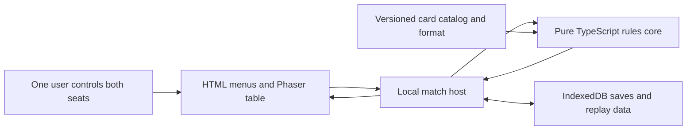
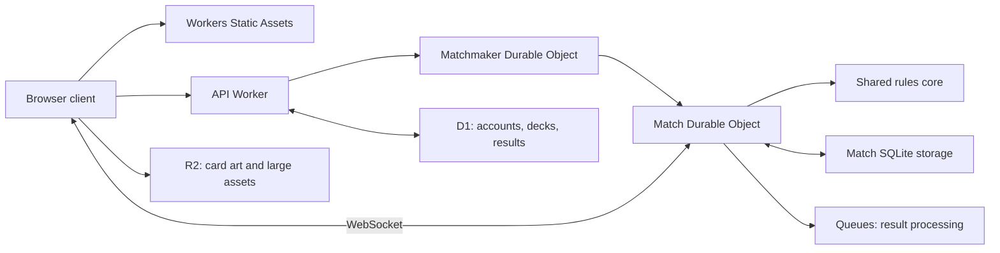

# Dissidia Card Game: Offline MVP Design

Date: 2026-10-06

Status: Approved for MVP implementation planning on 2026-10-07, including the Opus Placeholder decks. Light/Dark Commander identity remains a future production-format decision.

Branch: `feature/mvp-game-design-spec`

## 1. Product goal

Build an automated FFTCG rules simulator for one user who controls both players in an offline duel. Use original placeholder cards and artwork.

The first public product will offer online duels, matchmaking, and the complete Opus Zero + Opus I + Opus II + Opus III card pool. Every player can use every supported card. Deck construction limits still apply. There are no packs, ownership checks, collection progression, or card purchases.

The MVP uses the Opus Placeholder set to exercise mechanics needed for Opus Zero and Opus I-III. Its two supplied decks each contain 19 main-deck cards and one Commander. The complete real-card catalog follows in a later milestone. Opus IV and later remain future work.

Opus Zero is a custom set of staples made for this Commander format. Every player can use its supported cards under the same deck construction limits.

The UI/UX follows Magic: The Gathering Arena as closely as practical across the match table, card interactions, choices, and deck editor. Arena is the interaction and layout reference for implementation and acceptance. The game uses its own assets and FFTCG terminology. Pets and board cosmetics are excluded.

This spec covers the offline MVP and the boundaries needed for its online successor. Account integration, matchmaking, complete card implementation, and production operations need separate implementation plans.

## 2. Chosen technology stack

Use **TypeScript + Phaser**, with a pure TypeScript rules package and a desktop browser client. Use Vite for builds and a small HTML UI for menus, deck editing, searchable card lists, and the game log. Phaser owns the animated match table.

The main benefit is rules reuse. The offline host and the future authoritative Cloudflare host can import the same package. A turn-based card game needs correct state transitions more than a large rendering engine.

Phaser provides browser-focused 2D rendering and TypeScript support. Its tween system supports card movement and feedback. [Phaser overview](https://docs.phaser.io/), [Phaser tweens](https://docs.phaser.io/phaser/concepts/tweens)

Cloudflare supports TypeScript directly. The future online host runs the shared rules package in a Durable Object for each match. [Workers TypeScript](https://developers.cloudflare.com/workers/languages/typescript/)

Select exact dependency versions during implementation and commit a lockfile. This design does not depend on an unverified engine version.

## 3. Format: Commander Duel

**Commander** is the designated card's role in this format. **Legend** is the FFTCG rarity, represented by `L`. Use **Commander Zone** for the added zone and **Commander tax** for the recast surcharge.

### Confirmed rules

| Rule | Requirement |
|---|---|
| Players | Two players in a one-on-one duel |
| Deck | Production: exactly 49 main-deck cards plus one designated Commander. MVP playtest: exactly 19 main-deck cards plus one designated Commander |
| Commander eligibility | A Forward with Legend rarity, represented by rarity `L` |
| Singleton | Main-deck cards are singleton in both deck-size profiles |
| Colors | Each main-deck card shares at least one element with the Commander, or is Light or Dark |
| Colorless inclusion | Light and Dark cards are colorless for deck construction and can be included in any deck |
| Start location | The designated Commander begins face up in its owner's Commander Zone |
| Return | When the Commander leaves the field, its owner can choose the Commander Zone instead of its normal destination |
| Recast cost | The Commander costs two additional CP for each applicable previous summon |
| Damage | Seven damage from any source causes defeat; there is no separate Commander damage counter |
| Remaining rules | Use the supplied FFTCG comprehensive rules |

The Commander is one designated physical card instance. Another card with the same character name does not become a Commander. The designation and tax history survive zone changes.

### Confirmed MVP interpretations

These interpretations define the MVP Commander rules:

1. **Singleton uses card number.** Each card number can appear once across the main deck and the designated Commander. Different card numbers with the same name are permitted in the deck. FFTCG's field restrictions still apply. This also allows same-name variants to pay special ability costs. Singleton by name would need a separate format decision.
2. **Colors mean printed elements with the Light/Dark exception.** Deck legality uses the Commander's printed elements, fixed before play. Light and Dark cards are permitted regardless of that identity. Job, category, illustration, and element symbols inside ability text do not expand its deck identity. A temporary element change during play does not change deck legality.
3. **Commander casting is an additional legal source zone.** Its owner can cast it from the Commander Zone under the normal timing, cost, and field restrictions for a Forward. Casting an ordinary Forward does not use the stack.
4. **Tax counts successful casts from the Commander Zone.** With `n` previous successful casts from that zone, the additional cost is `2 × n` CP. A base cost of four becomes four, six, then eight. An illegal attempt does not increment `n`. Entering through an effect is not a cast. Casts from other zones do not increase this counter or receive this tax.
5. **Return is an optional replacement at field departure.** The owner chooses even if the opponent controls the Commander. If accepted, the card never reaches the replaced destination. Departure triggers can occur; triggers requiring arrival in the replaced zone do not. Declining the return leaves the card in the normal destination. There is no later free recall from that zone.
6. **The Commander Zone grants casting permission only.** Field abilities do not operate there unless card text explicitly permits it. It is public and belongs to the Commander's owner.

Tax adds CP to the normal casting cost before payment. It does not remove the required elemental CP. Cost modification follows the comprehensive rules.

The colorless designation applies to deck construction. During play, Light and Dark cards retain their printed elements, their CP-payment exceptions, the prohibition on discarding them for CP, and the combined Light/Dark field limit.

Deck exhaustion, concession, and simultaneous defeat remain valid outcomes. Seven damage is not the only possible way to end a game.

## 4. Card-pool feasibility

The official Japanese card-list data was inspected on 2026-10-06. Counts use distinct base card numbers from Opus I-III, including starter cards present in that data. Foils and alternate treatments do not count as new cards. Opus Zero is a separate custom catalog and is excluded from these counts.

| Printed element | Opus I | Opus II | Opus III | Combined |
|---|---:|---:|---:|---:|
| Fire | 35 | 24 | 25 | 84 |
| Ice | 35 | 24 | 24 | 83 |
| Wind | 35 | 24 | 25 | 84 |
| Earth | 35 | 24 | 24 | 83 |
| Lightning | 35 | 24 | 25 | 84 |
| Water | 35 | 24 | 25 | 84 |
| Light | 3 | 2 | 4 | 9 |
| Dark | 3 | 2 | 2 | 7 |

The 518 combined base card numbers are all single-element in this source. A standard-element Commander has 83 or 84 same-element cards plus 16 Light/Dark cards in its permitted pool. After reserving the Commander, 98 or 99 official cards remain for the 49-card main deck, before adding Opus Zero. These counts establish card-count feasibility, not competitive balance.

The permitted standard elements for a Light or Dark Commander need an explicit rule. Colorless inclusion alone does not give those Commanders an element identity. The choices presented for review are a chosen standard element, all six standard elements, or only Light/Dark cards. The last choice provides 15 remaining official cards. Opus Zero does not automatically change this identity rule or guarantee a complete colorless deck.

Sources: [Official card-list data](https://www.square-enix-shop.com/jp/ff-tcg/card/data/list_card.txt), [official list page and its data loader](https://www.square-enix-shop.com/jp/ff-tcg/card/opus1/fire.html), [Opus II release](https://fftcg.square-enix-games.com/en/release/opus-ii), [Opus III release](https://fftcg.square-enix-games.com/na/release/opus-iii).

The production catalog uses official base card identities, reviewed rules text, applicable errata, and card-specific rulings. Promo-only cards outside the three supported official sets are excluded from this launch definition. Reconcile the complete official catalog into an explicit manifest before full card implementation.

### Opus Zero: custom format staples

Opus Zero cards are legal exclusively in this Commander format. Its staples can occupy the 49-card main deck and follow singleton and element restrictions. An Opus Zero Forward of Legend rarity can be designated as the Commander under the existing eligibility rule.

Use a distinct `opus-zero` set identifier, `custom` provenance, and card numbers in the `0-` namespace. Each card has reviewed text, normal FFTCG metadata, a versioned ability definition, and acceptance scenarios. Commander designation remains match state; it is not a card rarity or a set identifier.

Design the initial custom roster in a focused content spec. Candidate staple roles include resource support, card selection, and Commander interaction. Do not assign new global rules or special color permissions merely because a card belongs to Opus Zero.

The MVP supports custom card definitions through the same catalog and ability interfaces as official cards. Opus Placeholder prototypes resource support, selection, and Commander interaction for future Opus Zero designs. Production Opus Zero cards receive their own approved definitions, numbers, and visible set label.

Pin the Opus Zero content version for each match. A balance change creates a new version for subsequent matches. Every supported Opus Zero card is available to every player.

## 5. Opus Placeholder: MVP playtest decks

### Set and format definition

Opus Placeholder has set identifier `opus-ph`, provenance `placeholder`, and card numbers in the `P-` namespace. Its first content version is `opus-ph-v1`. The 40 card definitions below are the complete initial set. Each listed card appears once in its assigned deck.

Use an explicit MVP playtest profile with 19 main-deck cards plus one Commander. Shuffle only the 19 main-deck cards. The Commander begins face up in the Commander Zone. Production decks continue to use 49 plus one.

Both profiles retain singleton by card number, element restrictions, five-card opening hands, the normal mulligan, normal draws, and defeat at seven damage. The MVP uses the same Commander return and tax rules. Opus Placeholder is legal in local playtest matches; production matchmaking accepts the production catalog.

| Seat | Deck | Commander | Main-deck composition | Main-deck card numbers |
|---|---|---|---|---|
| Player 1 | Cinder Company | Cinder Marshal, `P-001L` | 7 Forwards, 6 Backups, 6 Summons | `P-002C` through `P-020H`, using the exact suffixes below |
| Player 2 | Tidal Assembly | Tide Warden, `P-021L` | 7 Forwards, 6 Backups, 6 Summons | `P-022C` through `P-040R`, using the exact suffixes below |

Six Backups per deck make the five-Backup field limit observable. Two same-name generic Forwards exercise the generic icon. Each Commander has a main-deck variant with the same name and a different card number for special abilities and field uniqueness.

### Card conventions

- The rarity suffix is metadata: `C` Common, `R` Rare, `H` Hero, and `L` Legend. Only the two `L` Forwards are Commanders in these supplied decks.
- Every card has category `Placeholder`. Forwards have Job `Soldier`; Backups have Job `Support`; Summons have no job or power.
- **Generic** means that the card bears the generic icon. Every unmarked Character lacks that icon.
- **EX Burst** marks the entire Summon effect or the specific entry auto-ability immediately following that label. All unmarked cards have no EX Burst.
- `{Fire}` and `{Water}` mean one CP of that element. `{D}` is the dull icon and requires dulling the ability's source.
- `{S}` means discarding one card with the same name as the source. That discarded card does not also generate CP for the same payment.
- Text before a colon is a cost. Text after a colon is the effect. Named abilities containing `{S}` are special abilities.
- The CP column is the printed casting cost. Commander tax is added separately. Normal elemental payment rules apply to every cast.
- Backups enter dull and can produce CP under the normal rules. Forwards enter active unless an effect says otherwise.
- Card names inside their own text refer to that card instance. Same-name variants do not share abilities or Commander designation.

### Player 1: Cinder Company

This deck supplies attackers, damage effects, power modifiers, and removal. Its printed elements are Fire, Light, and Dark.

| Card number | Name | Element | Type | CP | Power | Rules text |
|---|---|---|---|---:|---:|---|
| P-001L | Cinder Marshal | Fire | Forward / Commander | 3 | 7000 | Brave. **Flare Order** — `{S}`, `{Fire}`, `{D}`: Choose 1 Forward. Deal it 7000 damage. |
| P-002C | Cinder Marshal | Fire | Forward | 2 | 5000 | No abilities. |
| P-003C | Ash Recruit | Fire | Forward | 1 | 3000 | **Generic.** No abilities. |
| P-004C | Ash Recruit | Fire | Forward | 2 | 5000 | **Generic.** No abilities. |
| P-005R | Spark Runner | Fire | Forward | 2 | 4000 | Haste. |
| P-006R | Ember Duelist | Fire | Forward | 3 | 6000 | First Strike. |
| P-007H | Dusk Reaver | Dark | Forward | 3 | 7000 | When Dusk Reaver enters the field, choose 1 Forward. It loses 2000 power until the end of the turn. |
| P-008H | Dawn Guardian | Light | Forward | 3 | 7000 | If Dawn Guardian would be dealt damage, reduce that damage by 1000 instead. |
| P-009C | Coal Tender | Fire | Backup | 1 | — | No abilities. |
| P-010C | Forge Apprentice | Fire | Backup | 1 | — | `{D}`: Choose 1 Fire Forward. It gains 1000 power until the end of the turn. |
| P-011R | Quartermaster | Fire | Backup | 2 | — | When Quartermaster enters the field, you may search for 1 Job Soldier and add it to your hand. |
| P-012H | Banner Smith | Fire | Backup | 2 | — | Fire Forwards you control gain 1000 power. |
| P-013R | Ember Medic | Fire | Backup | 2 | — | `{Fire}`, `{D}`, put Ember Medic into the Break Zone: Choose 1 Forward in your Break Zone. Add it to your hand. |
| P-014R | Cinder Witness | Fire | Backup | 2 | — | When a Forward you control is put from the field into the Break Zone, choose 1 Forward. Deal it 1000 damage. |
| P-015C | Scorch | Fire | Summon | 1 | — | **EX Burst.** Choose 1 Forward. Deal it 4000 damage. |
| P-016R | Twin Embers | Fire | Summon | 2 | — | Choose 2 Forwards. Deal each of them 3000 damage. |
| P-017R | War Cry | Fire | Summon | 1 | — | Choose 1 Forward. It gains 3000 power and Brave until the end of the turn. |
| P-018R | Ashen Verdict | Fire | Summon | 3 | — | Choose 1 dull Forward. Break it. |
| P-019H | Final Spark | Fire | Summon | 4 | — | Deal your opponent 2 points of damage. |
| P-020H | Controlled Burn | Fire | Summon | 3 | — | Select 1 of the following 2 actions: Choose 1 Backup of cost 2 or less. Break it; or choose 1 Forward. Remove it from the game. |

### Player 2: Tidal Assembly

This deck supplies responses, activation, Freeze, control changes, and recovery. Its printed elements are Water, Light, and Dark. Placeholder effects serve rules coverage and are not claims about official card designs.

| Card number | Name | Element | Type | CP | Power | Rules text |
|---|---|---|---|---:|---:|---|
| P-021L | Tide Warden | Water | Forward / Commander | 3 | 7000 | When Tide Warden enters the field, choose 1 Forward. Activate it. **Undertow** — `{S}`, `{Water}`, `{D}`: Choose 1 Forward. Return it to its owner's hand. |
| P-022C | Tide Warden | Water | Forward | 2 | 5000 | No abilities. |
| P-023C | River Recruit | Water | Forward | 1 | 3000 | **Generic.** No abilities. |
| P-024C | River Recruit | Water | Forward | 2 | 5000 | **Generic.** No abilities. |
| P-025R | Frost Binder | Water | Forward | 3 | 6000 | When Frost Binder enters the field, choose 1 Forward. Dull it and Freeze it. |
| P-026R | Tide Duelist | Water | Forward | 3 | 6000 | First Strike. |
| P-027H | Night Regent | Dark | Forward | 3 | 7000 | When Night Regent is put from the field into the Break Zone, choose 1 Forward. It loses power equal to Night Regent's power until the end of the turn. |
| P-028H | Dawn Arbiter | Light | Forward | 3 | 7000 | No abilities. |
| P-029C | Brook Tender | Water | Backup | 1 | — | No abilities. |
| P-030C | Wave Apprentice | Water | Backup | 1 | — | `{D}`: Choose 1 Forward. Activate it. |
| P-031R | Archive Keeper | Water | Backup | 2 | — | **EX Burst.** When Archive Keeper enters the field, draw 1 card, then discard 1 card. |
| P-032R | Recovery Clerk | Water | Backup | 2 | — | `{Water}`, `{D}`: Choose 1 card in your Break Zone. Put it on the bottom of your main deck. |
| P-033R | Tide Witness | Water | Backup | 2 | — | When a Forward you control leaves the field, you may draw 1 card. |
| P-034R | Mist Caller | Water | Backup | 2 | — | At the beginning of your End Phase, choose 1 Forward. Activate it. |
| P-035C | Return Tide | Water | Summon | 2 | — | **EX Burst.** Choose 1 Forward. Return it to its owner's hand. |
| P-036R | Stillwater | Water | Summon | 2 | — | Choose 1 Summon on the stack. Cancel its effect and put it into its owner's Break Zone. |
| P-037R | Guarding Current | Water | Summon | 1 | — | Choose 1 Forward. It gains 2000 power and First Strike until the end of the turn. |
| P-038R | Shape Tide | Water | Summon | 2 | — | Choose 1 Forward. Its power becomes 4000 until the end of the turn. |
| P-039H | Borrowed Banner | Water | Summon | 4 | — | Choose 1 Character your opponent controls on the field. Gain control of it until the end of the turn. |
| P-040R | Rising Undertow | Water | Summon | 2 | — | Draw 2 cards. At the beginning of your End Phase, discard 1 card. |

### Resolution details

The two cards chosen by Twin Embers must be distinct. If one becomes illegal before resolution, apply damage to the remaining legal target. If both become illegal, cancel all of its effects.

Controlled Burn's controller chooses its mode and the corresponding target when casting it. Stillwater can choose a Summon already on the stack; it cannot choose itself. It cannot respond to EX Burst.

Quartermaster searches only the main deck. The search includes the normal reveal and shuffle procedure. A player can fail a search for this specified characteristic. The Commander in the Commander Zone is outside the searched zone.

Archive Keeper's EX Burst applies its marked draw-and-discard effect while the card remains in the Damage Zone. The Backup is not deployed by EX Burst. Final Spark places both damage cards before resolving eligible EX Bursts in their damage order, subject to the comprehensive defeat rules.

Shape Tide sets base power. Apply other ongoing power changes in the required order. Night Regent's departure ability uses its last-known power, including applicable modifiers before departure.

Dawn Guardian reduces each damage event separately, to a minimum of zero. This is a replacement effect. It does not reduce a loss of power.

Borrowed Banner changes control, not ownership. It does not make a Character enter the field again. Recompute control-duration restrictions and field limits. Expire its control effect during end-of-turn cleanup. If the Character changes zones first, the effect does not follow the new object. A departing stolen Commander still gives its owner the return choice.

Rising Undertow creates a delayed auto-ability for the current turn's End Phase. Mist Caller and this delayed ability can trigger together; their controller selects their stack order under the rules. End Phase priority does not permit casting Summons or using action or special abilities.

### Playtest coverage

These decks cover the main interaction systems through repeated matches and focused starting positions. A single shuffled match will not expose every interaction.

| Rule area | Cards or situation | Playtest check |
|---|---|---|
| Setup and outcomes | Both 19-card decks | Opening hands, mulligan, first draw, normal draws, hand cleanup, seven damage, deck exhaustion, concession |
| Commander rules | P-001L and P-021L with P-018R, P-020H, P-035C, or combat | Initial cost 3; later Commander Zone casts cost 5 and 7; accept and decline return; keep designation across zones |
| Special abilities and name uniqueness | Each Commander and its C-rarity namesake | Spend the same-name card for `{S}`; it cannot also pay CP; reject deploying the nongeneric namesake beside the Commander |
| Generic icon and parties | P-003C/P-004C and P-023C/P-024C | Same-name generic cards coexist; same-element Forwards form parties; assign blocker damage in legal increments |
| CP and Backup limits | Six Backups per deck; Light/Dark Forwards | Dull and discard payments; elemental requirements; generated surplus; reject a sixth normally cast Backup; reject discarding Light/Dark for CP |
| Attack timing | P-001L, P-005R, P-030C, P-017R | Haste permits immediate attack; Brave preserves active status; activating a Forward does not reset its attack count |
| First Strike | P-006R, P-026R, P-037R | Individual First Strike; mixed parties; an all-First-Strike party after Guarding Current; restricted intermediate processing |
| Dull, activation, Freeze | P-025R, P-030C, P-034R | Legal blocking; next Active Phase; an explicit activation can activate a frozen Forward |
| Stack, responses, and targets | P-015C, P-016R, P-035C, P-036R | Consecutive passes; stack order; all or some targets become illegal; cancel a Summon |
| Field and temporary effects | P-007H, P-010C, P-012H, P-017R, P-037R, P-038R | Power modification order; power at or below zero; end-of-turn cleanup; buff disappears when Banner Smith leaves |
| Search, recursion, and zones | P-011R, P-013R, P-020H, P-032R | Reveal and shuffle; Break Zone recovery; removed-from-play access; new object after a zone change |
| Independent abilities and last-known information | P-013R and P-027H | Ember Medic leaves as a cost but its ability resolves; Night Regent uses its last-known power |
| Entry, departure, and destination triggers | P-007H, P-014R, P-021L, P-033R | Commander return triggers departure; a replaced Break Zone destination does not trigger Cinder Witness |
| Damage and EX Burst | P-015C, P-019H, P-031R, P-035C | Optional EX Burst; multiple damage cards; no response to EX Burst; damage from a Summon can end the game |
| Replacement effects | P-008H and Commander return | Damage prevention versus power loss; replacement before the original event occurs |
| Control and rule processes | P-039H with Backups or Light/Dark cards | Control versus ownership; no entry trigger; excess Backups; conflicting Light/Dark Characters; owner chooses Commander return |
| End Phase and delayed effects | P-034R and P-040R | Trigger ordering, required discard, restricted actions, and final cleanup |

### Playtest procedure and limits

Offer a normal shuffled match and record its seed. Use the default decks exactly as listed. The user can inspect both hands and control each decision.

Provide focused scenario presets for interactions that random draws rarely arrange: a third Commander cast, multiple EX Bursts, conflicting controlled Characters, and overlapping End Phase triggers. Each preset starts a separate local scenario from validated state; it does not alter the rules of an ongoing normal match.

Nineteen-card main decks deplete quickly under FFTCG's draw and damage rules. Deck exhaustion is a valid expected outcome. Use scenario presets to examine expensive recasts without increasing deck size or changing the draw rules.

The cards are rules fixtures with provisional power levels. Balance is a playtest outcome. These lists do not cover every card-specific exception, variable cost, mandatory loop, or later-set mechanic. The broader automated rules suite remains necessary.

## 6. MVP scope

### Included

- One local match with both seats controlled by the same user.
- A rules-enforced duel from deck selection through an outcome.
- The Commander Zone, optional return, recast tax, and deck validation.
- The two Opus Placeholder decks above, each with 19 main-deck cards and one Commander, plus a basic deck editor.
- Original placeholder names, readable card faces, and simple original art or geometric illustrations.
- Exactly 40 initial `opus-ph` card definitions with `P-` card numbers, including two Commander-eligible Forwards of Legend rarity.
- Representative cards for the rule and effect systems needed by Opus Zero + Opus I-III.
- Placeholder prototypes of Opus Zero staple roles, plus set provenance, legality, and version handling.
- Explicit payment, target, mode, trigger-order, and other required choices.
- A phase indicator, priority indicator, stack display, and readable event log.
- Local save, resume, and a versioned export of a match for debugging.
- A cached release that can start and play without an Internet connection after installation.

The defined catalog includes same-name cards with different numbers for special abilities and field uniqueness. Its card tables and coverage matrix specify the purpose of each behavior. Persist the chosen deck-size profile and content version with each match.

### Deferred

The MVP excludes online accounts, matchmaking, rankings, AI opponents, spectators, public replay sharing, full real-card data, and production artwork. It also excludes Opus IV onward and multiplayer rules.

The MVP is not complete if the user must manually adjust damage, ignore illegal actions, or act as the rules referee. Optional developer tools can inspect state, but the normal match remains rules enforced.

## 7. Rules baseline and coverage

The baseline is [FFTCG Comprehensive Rules v3.3](../../fftcg-comprules-v3.3.pdf), effective August 7, 2026. This is the supplied document, not a historical Opus I rule snapshot.

The Commander format overrides only its documented differences. Ordinary card text and comprehensive-rule precedence still apply. The initial engine covers the systems required for the supported card pool. Modern mechanics outside that pool need later extensions.

| System | Required behavior | Rule references |
|---|---|---|
| Setup | Random choice of starting player; five-card opening hands; one ordered bottom-deck mulligan per player; one draw for the first player's first turn | 8.2 |
| Turns | Active, Draw, Main 1, Attack, Main 2, End; five-card hand cleanup; damage and temporary-effect cleanup | 9 |
| Zones | Ordered main deck and Damage Zone; hand; shared field and stack; Break Zone; removed from play; added Commander Zone | 7 and format rules |
| CP | Discard for two CP; dull eligible Backups for one CP; element requirements; Light/Dark exceptions; current v3.3 generated-CP and payment rules | 5.2.1, 11.2 |
| Character casting | Legal timing and field limits; Backups enter dull; ordinary Character casting is a special action | 5.2.3, 7.7, 9.3, 11.4 |
| Priority and stack | Consecutive passes; last-in-first-out resolution; correct priority restoration; rule processes and pending triggers before priority | 11.1, 11.8, 12 |
| Abilities | Action, special, auto, and field abilities; independent stack objects; target legality; last-known information | 6.4, 11.5-11.12 |
| Effects | One-time, ongoing, and replacement effects; correct ordering and timestamps; optional choices and delayed triggers | 11.8, 11.12 |
| Combat | Sequential attacks; same-element parties; legal blockers; battle damage; party damage assignment; once-per-turn attack tracking | 10 |
| Damage and EX Burst | Damage cards come from the deck; optional EX Burst; EX Burst is not a response window or normal stack item; correct multi-damage ordering | 6.5, 11.10 |
| Keywords | Applicable keyword behavior, including Brave, Haste, First Strike, and Freeze; other supported-card text represented by handlers | 15 |
| Outcomes | Seven damage; empty-deck defeat conditions; concession; simultaneous defeat; mandatory-loop draws | 3, 12-13 |
| Illegal actions | Rejection or rewind without partial payment, triggers, or changes to priority | 14 |

Rule 11.2 was revised in v3.3. Use its explicit generated-CP and spent-CP procedure rather than an older tutorial's overpayment shortcut.

Combat must retain FFTCG's sequence. The UI cannot combine all attacks into MTG's declaration model. Brave does not permit a second attack. First Strike has its own restricted intermediate processing.

Before full card authoring, inventory every Opus Zero + Opus I-III card against this coverage table. Card-specific implementations need their own fixtures. Passing these core scenarios alone does not establish that all supported cards work.

## 8. Offline architecture

Use a client-only match host for the MVP. A local HTTP server can serve development files, but it does not own game state. A packaged cached release runs its match locally.

### Component boundaries

| Component | Responsibility | Dependencies |
|---|---|---|
| Rules core | Validate commands; apply costs and effects; schedule phases, priority, choices, and outcomes | Domain types and supplied content; no renderer, browser, networking, or database |
| Card catalog | Card metadata, abilities, handler references, and content version | Rules interfaces |
| Commander format | Deck legality, Commander designation, zone permission, return choice, and tax | Rules extension points |
| Local match host | Serialize commands; own state; provide views; save accepted progress | Rules core and local persistence |
| Match protocol | Command and response schemas; version and sequence handling | Domain types |
| Client | Input, card inspection, table layout, prompts, and animation | Player views and protocol |

Keep the rules core independent of Phaser. Card display objects are never game state. The initial local host can run in the same JavaScript process; its interface must also work across a browser Web Worker boundary.

### Command flow

1. The client requests an action or answers the current choice for a specified seat.
2. The host checks the sequence and passes the command to the rules core.
3. The core validates timing, actor, costs, targets, and restrictions.
4. A valid command produces a new state, ordered events, and any next choice.
5. The host saves accepted progress and returns views to the client.
6. The client animates events and presents the next decision.

Choose payment sources and casting declarations before submitting a cast. Commit costs together after full validation. Resolution choices can pause processing in an explicit serializable continuation.

The host accepts one command at a time. An invalid command leaves state and replay history unchanged and returns a specific explanation. Canceling an unfinished UI selection does not submit a game action.

## 9. State, card definitions, and determinism

The match state includes both players, ownership and control, ordered zones, turn and phase, priority, pass history, stack objects, effects, timestamps, pending triggers, choices, and the result.

Track stable card-instance identity separately from the new object identity created by zone changes. Commander designation and tax history use stable identity. Targets and temporary effects use the appropriate zone-object identity.

Each card definition contains its card number, name, set, provenance, content version, rarity, type, elements, CP cost, jobs, categories, generic icon, power where applicable, keywords, abilities, and EX Burst information. Display text is distinct from executable rules. Legend rarity and Commander designation are separate fields.

Use typed ability handlers and a small set of shared effect operations. Do not interpret arbitrary rules text at runtime. Avoid a universal scripting language in the MVP. A handler can request a choice and resume through a named, serializable step.

Given the same versions, initial random state, and accepted commands, the engine must produce the same result. Randomness comes from an explicit seeded generator. Wall-clock time and renderer timing do not change the rules.

Version match data with schema, engine, format, and catalog identifiers. Resume only compatible data, or use a defined migration. An incompatible save gets an explanation and can still be exported; it must not silently run against different card behavior.

Offline saves include the authoritative snapshot, random state, accepted command log, and unresolved choice state. Exported diagnostic files can contain both hands because one user controls both seats.

Online random state and unrevealed card identities stay on the server. A public event stream is not the full diagnostic replay.

## 10. Interaction and visual direction

### Arena fidelity requirement

Follow Magic Arena's desktop UI/UX closely. This requirement covers layout, hand behavior, casting, targeting, choices, stack inspection, combat selection, and card browsing. Use the user's requested bottom-left placement for contextual choice buttons. Keep this placement consistent across decisions.

Use one fixed board with original artwork, warm metallic accents, and readable element symbols. Include functional card movement, targeting, and damage effects. Exclude pets, pet slots, decorative board interactions, selectable board skins, and cosmetic customization controls.

Target desktop browsers with mouse and keyboard for the MVP. The table must remain usable at 1280 × 720 and readable at 1920 × 1080. Mobile layout is a later design task.

### Table and hand placement

Place the controlled seat's hand in a curved, overlapping fan at bottom center, close to the lower edge. Lift and enlarge the hovered card above its neighbors. Neighboring cards spread enough for selection, then settle when focus moves. Keep the opponent's hand across the top. The battlefield occupies the center, with Forwards nearer the opponent and Backups behind them.

Allow local hand reordering without a rules command. A horizontal drag within the hand reorders its presentation. An upward drag beyond the hand's play threshold starts casting. Cancel restores the previous presentation order. Sorting cannot change deck order, damage order, or any rules-defined selection order.

Reserve bottom-left space for contextual choice controls, including Confirm, Cancel, Decline, and selection counts. Reserve bottom-right space for priority/phase progression. Keep these controls outside the hand's hit area. Central instruction text describes the current decision. A required choice disables the ordinary progression control.

Place each player's damage indicator near their player marker, with seven inspectable Damage Zone slots. Keep deck counts, Break Zone, and removed-from-play access visible at the table edges. Keep the stack in a compact side column that expands for inspection. Show whose turn and priority it is separately. Each Commander Zone retains its visible slot and next cast cost.

Use card thumbnails, enlarged card previews, selected-card lift, target highlights, and arrows throughout the match. Selection happens directly on cards wherever possible. The game log opens from a compact control instead of consuming a permanent large section of the board.

### Cards playable from other zones

The bottom card area contains the actual hand plus a visually separated extension for cards with permission to be cast from another zone. The Commander appears in this extension while it is in the Commander Zone. It uses the same hover, click, drag, targeting, and payment flow as a hand card.

Give each extension card a persistent source-zone badge. Keep its real zone and card identity unchanged until the engine accepts the cast. The Commander Zone slot and the extension represent the same card. They must never create two instances or submit two casts.

Hand counts, mulligans, CP discards, special-ability discards, and hand cleanup include actual hand cards only. A Commander shown beside the hand cannot pay a hand-discard cost. A returned Commander appears in the extension with its updated tax. A Commander returned to the hand appears as an actual hand card, with normal hand-casting costs.

Only rules-granted casting permission adds a non-hand card to the extension. If a future supported effect permits a cast from the Break Zone or removed zone, use this same presentation. A card that can only be recovered to hand remains a recovery target in its zone browser. It does not receive casting permission.

Keep the Commander visible but inactive when timing, priority, targets, or payment prevent a cast. Glow means a legal declaration can currently be completed. Hover explains why an inactive card cannot be played. Recompute availability after every accepted command and view change. Expired permission or a zone change removes the old representation immediately.

When the combined card area grows, compress the fan within a readable limit and provide horizontal browsing or a collapsible zone group. Every card must remain reachable. Neither the hand nor its extension can cover the bottom-left choice controls or bottom-right progression controls.

### Casting and targeting

Support both click-to-play and drag-to-play in the MVP. Clicking a playable card or dragging it upward starts the same local action draft. A card with multiple modes or abilities offers a compact card-based selector. A card with one cast action enters that flow directly.

Lift the source card into a casting position. Highlight valid targets and draw a source-to-cursor targeting arrow. The arrow snaps to a valid hovered target. Selecting targets keeps visible source-to-target arrows and numbered markers when order matters. Illegal targets cannot confirm a selection. Multiple-target effects show progress such as `1 / 2 targets`.

Use the same direct selection language for attackers, parties, and blockers. Show combat arrows and selected-card highlights. FFTCG still declares sequential attacks and uses its own party and damage rules.

Select CP sources directly on hand cards and Backups. Distinguish CP discards, special-ability discards, and dulled sources with different labels and markers. Show total cost, elemental requirements, Commander tax, and generated/spent CP beside the draft. Keep Confirm and Cancel in the bottom-left choice area.

Cancel, Escape, or an invalid drag release restores the card presentation without spending CP or changing game state. Before submission, the user can revise targets and payment. An accepted cast follows the real source zone's animation path. Character casting still bypasses the stack; Summons and applicable abilities appear in the stack column.

### Decisions and browsing

Target selection keeps the battlefield visible. Search, reveal, mulligan, discard, and ordering use card rows or browser overlays when needed. Highlight eligible cards, expose the selection count, and keep contextual choice controls at bottom left. Use card thumbnails for modes and ordered triggers when the source has a card representation.

Commander return presents explicit `Return to Commander Zone` and `Use normal destination` choices. EX Burst presents `Use EX Burst` and `Decline`. Mandatory choices have no fake Cancel action. Escape only cancels an unsubmitted action draft; it cannot dismiss an unresolved rules decision.

Use Arena's card-grid and deck-list arrangement for the card browser and deck editor. Search and element/type filters lead into card inspection and direct add/remove actions. Show all supported cards as available. Use the existing deck rules and omit ownership or purchase controls.

Carry the same visual hierarchy into opening-hand selection, pause/settings, confirmation overlays, and match results. Keep the board visible behind contextual overlays where possible. Menus expose this MVP's existing features without adding Arena's unrelated progression systems.

Use FFTCG labels: Active, Dull, CP, Forward, Backup, Summon, Break Zone, and Commander. Visual similarity to Arena must not change FFTCG mechanics.

### Control of both players

The active control seat follows the player required to make the next decision, including responses and resolution choices. The user can inspect either hand and switch views. No privacy handoff screen is required for this single-user simulator.

When control changes seats, reorient the table so the decision player's hand and playable-zone extension occupy the bottom. Preserve source/target identity during the transition. Inspection of the other hand does not transfer control or cancel a pending choice. Complete pointer gestures before a seat transition; discard stale unsubmitted drafts when authority changes.

Seat-specific projections still exist. A test mode can conceal the other hand to exercise the future online view. Omniscient controls belong to the offline simulator.

### Inputs and feedback

- Clicking and dragging are both required play paths. They share action drafts, targeting, payment, and engine validation.
- Payment selection shows total CP, required elements, discarded cards, dulled Backups, and Commander tax.
- Targets, modes, party members, damage assignments, trigger order, and optional Commander return use explicit prompts.
- Passing priority is separate from ending a turn. A shortcut cannot skip a required opponent decision.
- Card text is available at readable size. Element symbols and labels supplement color.
- Reduced motion preserves all information. Animation completion never controls rules resolution.

The MVP uses manual priority passes to expose rules behavior. Automatic passing can follow once response opportunities are tested.

### UI acceptance

Compare the implementation with desktop Arena reference frames for the idle board, hovered hand, casting, targeting, a choice, the stack, and deck editing. Record intentional FFTCG adaptations and the requested bottom-left choice placement. These comparisons are a milestone 3 acceptance gate.

Browser tests must cover hand fan selection, non-hand Commander casting, target arrows, invalid drag cancellation, and bottom-left choice placement. Test both viewport sizes and reduced motion. A menu-only casting interface or inaccessible overflow cards fail this gate. Pets and cosmetic board controls must be absent.

Official Arena design notes illustrate card-selection and ordering flows with contextual confirmation. They also explain why UI shortcuts must preserve rules choices. These are supporting references; the layout and behavior above are this project's explicit requirements. [Sylvan Library UI design](https://magic.wizards.com/en/news/mtg-arena/dev-diary-sylvan-library), [card presentation and choice-interface updates](https://magic.wizards.com/en/news/mtg-arena/mtg-arena-state-game-the-brothers-war).

## 11. Offline delivery and persistence

The release bundles all code, fonts, placeholder art, and catalog data. Its service worker caches a complete version for offline use. Installation requires an initial download; a clean machine cannot obtain the application without a transfer.

Development can run on localhost without Internet access once dependencies are installed. A release can be served by a local static server or installed from a hosted build.

Save after each accepted command in IndexedDB. Keep pending decisions resumable. Export and import provide a portable copy if browser storage is cleared. A failed save produces a visible persistence error without fabricating a saved state.

Apply updates between matches. A cached client and its rules/catalog versions must remain consistent throughout a match. The production online client will require a network connection for matches; the offline simulator remains a development tool.

## 12. Cloudflare online architecture

The same rules package moves behind an authoritative online host. Clients submit intent and receive filtered views. They cannot submit trusted damage, card draws, or outcomes.

| Service | Planned responsibility |
|---|---|
| Workers Static Assets | Client bundle and small static assets, with caching |
| API Workers | Authenticated account, deck, catalog, queue, and match-entry APIs |
| Durable Objects | One authoritative object per match; serialized state changes; regional matchmaking coordination |
| Durable Object SQLite storage | Accepted commands, state, pending choices, deadlines, and recovery data |
| Hibernating WebSockets | Match updates and reconnection; idle connections without keeping the object in memory |
| D1 | Accounts, deck lists, match summaries, and matchmaking metadata |
| R2 | Versioned card art and larger replay artifacts |
| Queues | Retryable result summaries and replay processing after match completion |
| Turnstile and rate limits | Abuse controls for account and matchmaking entry points |
| Workers observability | Errors, command latency, disconnects, and rule-handler failures |

Workers can host static assets and APIs together. Durable Objects provide serialized shared state and WebSockets; their storage survives restarts. D1 fits relational records, and R2 fits larger assets. These are documented capabilities; the allocation above is the proposed design. [Static Assets](https://developers.cloudflare.com/workers/static-assets/), [Durable Object coordination](https://developers.cloudflare.com/durable-objects/best-practices/rules-of-durable-objects/), [match storage](https://developers.cloudflare.com/durable-objects/best-practices/access-durable-objects-storage/), [WebSocket hibernation](https://developers.cloudflare.com/durable-objects/best-practices/websockets/), [D1](https://developers.cloudflare.com/d1/), [R2](https://developers.cloudflare.com/r2/)

### Match integrity and recovery

The server authenticates the player and derives their seat. It checks command ID, expected state sequence, payload, and action legality. Duplicate commands return the prior result instead of paying costs twice.

Persist accepted progress before acknowledging it. After hibernation or restart, reconstruct the match from durable state. Reconnection sends the player's current filtered view and unresolved choice. Hidden hands, deck order, random state, and unrevealed choices stay private.

Use Durable Object alarms for online decision deadlines. A client animation or local clock cannot decide a timeout. The later online spec must define reconnect grace periods and timeout outcomes.

Pin match versions until completion. A new deployment must not change an ongoing match's rules. Result processing is idempotent by match ID and result version.

### Matchmaking progression

Start online development with private two-player rooms. Then add an unranked queue partitioned by region and format version. Reserve both entries before issuing match tickets. Expired entries and canceled searches cannot remain matchable.

Add ratings and skill-based matching only after match completion, reconnect handling, and queue cancellation work. A match object runs in one location; hosting on Cloudflare does not eliminate distance between two players.

## 13. Verification and acceptance

Use headless rules scenarios first, then browser interaction tests. Each scenario records the relevant rule number or Commander-format requirement and asserts meaningful state transitions.

| Area | Required scenarios |
|---|---|
| Deck validation | MVP profile: 18/20 main cards rejected and 19 accepted; production profile: 48/50 rejected and 49 accepted; duplicate number rejected; same-name variants handled; wrong standard element rejected; Light/Dark cards accepted in each deck; non-Forward or non-L Commander rejected |
| Setup | Both choices of starting player; mulligan order; first-turn draw; Commander excluded from the shuffled main deck |
| CP | Matching element; mixed payment; Light/Dark discard prohibition; exact spent CP; generated surplus expiry; all costs rolled back on an illegal cast |
| Priority | Cast retains or restores the correct priority; two passes resolve one stack item; empty-stack passes advance correctly; pending triggers and rule processes |
| Combat | Newly controlled Forward restriction; Haste; Brave attacks once; legal blocker; unblocked damage; party formation and damage assignment; First Strike |
| Effects | Invalid targets; partial valid targets; source leaves field; effect ordering; replacements; delayed triggers; choices by either player |
| EX Burst | Accept and decline; no response window; multiple damage cards in order; correct defeat timing |
| Commander | Initial cost; second and third taxed casts; illegal cast does not increment tax; accept/decline return; return from opponent control; correct destination triggers; persistent designation |
| Opus Zero | Custom staples are legal in the main deck; ordinary element and singleton restrictions; eligible Forward of Legend rarity can be Commander; set and provenance displayed; content version pinned; test-only fixtures excluded from production decks |
| Opus Placeholder | All 40 table definitions load with exact metadata; each supplied deck is 19 plus one; every coverage row has a scenario; `opus-ph` is accepted locally and rejected in production matchmaking; Commander and rarity labels remain distinct |
| End and outcome | Hand discard; damage cleanup; temporary effects end; seven damage; deck exhaustion; concession; simultaneous defeat; mandatory-loop draw |
| Persistence | Resume at a priority window and during a choice; identical replay; rejected incompatible version; export/import |
| Offline | With network disabled, start the cached release, complete a duel, reload, and resume |
| Views | Seat projections hide opponent cards and deck order; offline inspection remains available |

Add invariants for card conservation, one zone per card, nonnegative counters, legal ownership, and valid pending decisions. Do not represent a processing budget limit as a rules-mandated draw unless a mandatory loop is established.

The MVP passes acceptance when the supplied decks complete full duels without manual rule corrections, the coverage scenarios pass, and offline save/resume works.

The full card release has an additional gate: all supported official and Opus Zero card definitions have reviewed metadata and executable behavior, with scenarios for each distinct ability. Placeholder coverage does not satisfy that gate.

## 14. Delivery order

| Milestone | Deliverable | Exit condition |
|---|---|---|
| 1. Rules foundation | Domain model, format validation, setup, phases, CP, ordinary casting, and outcomes | Headless setup-to-concession transcript, deterministic replay, and Commander foundation scenarios pass |
| 2. Rules interactions | Stack, abilities, effects, combat, EX Burst, and required choices | Coverage table has executable scenarios |
| 3. Offline playable MVP | Phaser table, two-seat controls, both 19-plus-one Opus Placeholder decks, focused scenario presets, deck editor, saves, and offline package | Complete offline duels and recovery without manual rule corrections; placeholder coverage scenarios pass |
| 4. Real-card offline validation | Opus Zero + Opus I-III catalog, errata review, and card-specific handlers | Full-card gate passes in the local simulator |
| 5. Online private matches | Authoritative Durable Object host, identity, filtered views, reconnects, and deadlines | Two clients complete and recover matches |
| 6. Online matchmaking | Unranked queue, cancellation, reservations, results, and observability | Queue-to-result flow survives retries and disconnects |

The [MVP implementation plan](../plans/2026-10-07-playtest-ready-mvp.md) covers milestones 1–3 together, as requested on 2026-10-07. Each milestone has its own tasks and exit gate. Completing all three produces the offline MVP ready for playtesting. Milestones 4–6 need later plans.

## 15. Review decisions

The user has confirmed Commander terminology, TypeScript + Phaser, the Opus Zero + Opus I-III content scope, and unrestricted Light/Dark card inclusion. The MVP uses representative cards in `opus-ph`, `P-` card numbers, and 19 main-deck cards plus one Commander per player. The user approved the design for implementation planning on 2026-10-07. Card balance remains subject to playtesting.

The chosen stack is TypeScript + Phaser with a local match host. The MVP uses card-number singleton, printed-element identity, tax on casts from the Commander Zone, and optional return as a replacement effect.

Light/Dark Commander deck identity remains a concrete format decision, as described in the card-pool section. Standard-element Commanders have enough cards under the confirmed rules.

The implementation plan is in `docs/superpowers/plans/2026-10-07-playtest-ready-mvp.md`. This planning request does not authorize implementation or publication.
